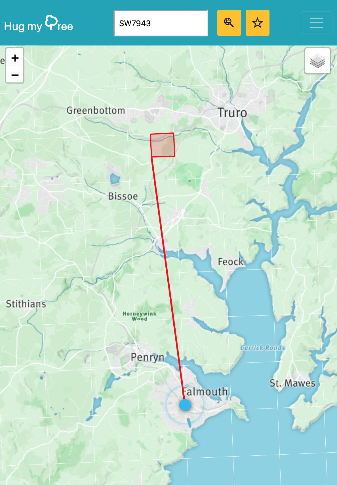
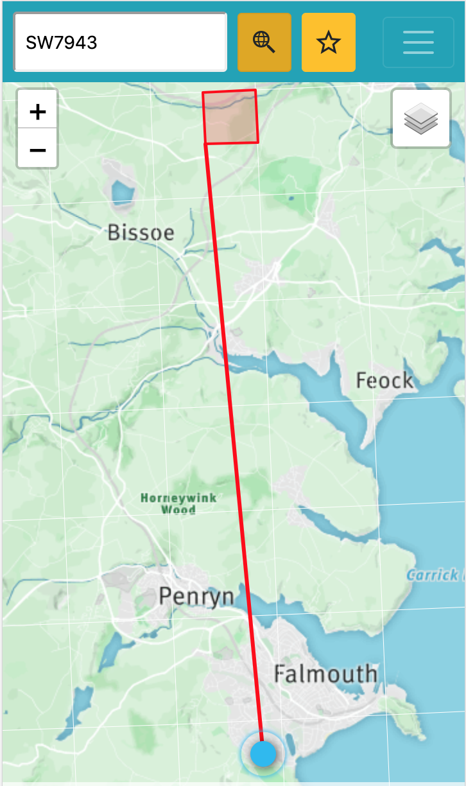

# Hug My Trees

This is a fun little app that shows your location on a map.

It allows you to add a different grid ref, and shows you a line between you and that marker. As you move, it will update.

Save the location using the star icon next to the search and it will save the location to local storage.

Desktop View

Mobile View

## Installation

`npm install`

## Build and Run the application locally

Update `src/config/config.js` with your map credentials.

Then run `npm run build`. This uses ParcelJS to build and run the application on localhost.
